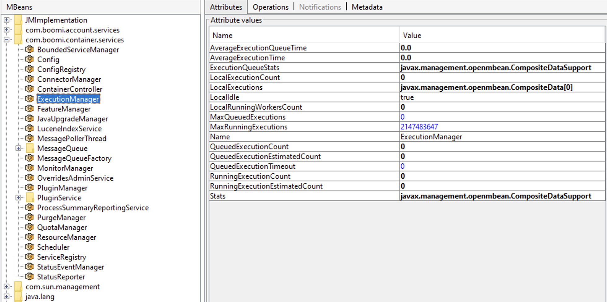

# Boomi data collector structure

The data coming from the Influx Telegraf monitoring Atoms are structured into nodes and metrics.

Nodes are logical entities that contain metrics that we already know “work together,” and correlations are given.

The nodes contain a set of different metrics, and as seen in the table below, the Eyer structure replicates how Boomi exposes the Atom JMX metrics. The table contains all metrics that Eyer is monitoring on an Atom.

Most metrics we monitor are described in[ System Monitoring with JMX from Boomi](https://help.boomi.com/docs/atomsphere/integration/integration%20management/r-atm-system_monitoring_with_jmx_3c582f4e-29ce-4cd4-a246-be25bd36b583/#general-jvm-status), but there are a few more (see the table below).

<table>
  <tr>
   <td>Node Name</td>
   <td>Metric Name</td>
   <td>GUID</td>
   <td>Aggregation</td>
   <td>Notes</td>
  </tr>
  <tr>
   <td>Operating System</td>
   <td></td>
   <td></td>
   <td></td>
   <td></td>
  </tr>
  <tr>
   <td></td>
   <td>System CPU Load</td>
   <td>5523ee20-2af2-4b8e-8390-3d2cb4410018</td>
   <td>avg</td>
   <td>java.lang value</td>
  </tr>
  <tr>
   <td></td>
   <td>Committed Virtual Memory Size</td>
   <td>2ce746c5-1ee3-45d1-b23f-bae56bc5d51a</td>
   <td>avg</td>
   <td>java.lang value</td>
  </tr>
  <tr>
   <td></td>
   <td>Heap Memory Usage Committed</td>
   <td>324b4bb1-cf29-4dce-9539-479d8b3bb41b</td>
   <td>avg</td>
   <td>java.lang value</td>
  </tr>
  <tr>
   <td></td>
   <td>Heap Memory Usage Used</td>
   <td>631bf72c-0b1a-4f74-929c-d60360a71896</td>
   <td>avg</td>
   <td></td>
  </tr>
  <tr>
   <td></td>
   <td>Process CPU Load</td>
   <td>a59df24a-e9ec-4c4c-a087-ea1375d4b9c7</td>
   <td>avg</td>
   <td>java.lang value</td>
  </tr>
  <tr>
   <td></td>
   <td>Total Physical Memory Size</td>
   <td>8edca7a9-b9aa-487b-a68c-ddaf18393a3d</td>
   <td>avg</td>
   <td>java.lang value</td>
  </tr>
  <tr>
   <td>Execution Manager</td>
   <td></td>
   <td></td>
   <td></td>
   <td></td>
  </tr>
  <tr>
   <td></td>
   <td>Average Execution Queue Time</td>
   <td>b0ea4cd2-823f-4539-be9a-6a3ef3365964</td>
   <td>avg</td>
   <td></td>
  </tr>
  <tr>
   <td></td>
   <td>Average Execution Time</td>
   <td>50060171-414b-4cbd-8534-5b0d9338c86b</td>
   <td>avg</td>
   <td></td>
  </tr>
  <tr>
   <td></td>
   <td>Local Running Workers Count</td>
   <td>27dad857-3cc3-4daf-8671-114678579f04</td>
   <td>avg</td>
   <td></td>
  </tr>
  <tr>
   <td></td>
   <td>Queued Execution Estimated Count</td>
   <td>80c9b07c-d11a-4857-a6b4-323a300bd9ef</td>
   <td>avg</td>
   <td></td>
  </tr>
  <tr>
   <td></td>
   <td>Running Execution Estimated Count</td>
   <td>0dee40ce-19bf-4717-ac9e-1465f8c62cf3</td>
   <td>avg</td>
   <td></td>
  </tr>
  <tr>
   <td>Resource Manager</td>
   <td></td>
   <td></td>
   <td></td>
   <td></td>
  </tr><tr>
   <td></td>
   <td>Atom In Bad State</td>
   <td>8e838d01-69fa-4b48-8e6d-9fd0d82d80c7</td>
   <td>max</td>
   <td>com.boomi.container.services</td>
  </tr>
  <tr>
   <td></td>
   <td>Deadlock Detected</td>
   <td>5318feea-b009-4da0-a94a-98bdfddad45e</td>
   <td>max</td>
   <td>com.boomi.container.services</td>
  </tr>
  <tr>
   <td></td>
   <td>Low Memory</td>
   <td>ab4af37f-f63b-4ca0-9145-e020534460e2</td>
   <td>max</td>
   <td></td>
  </tr>
  <tr>
   <td></td>
   <td>Out Of Memory</td>
   <td>d991d4f8-042a-4e35-bec2-698bce56af0e</td>
   <td>max</td>
   <td></td>
  </tr>
  <tr>
   <td></td>
   <td>Too Many Open Files</td>
   <td>8cd82c74-7a2d-4b31-b41e-a8d176bc3a49</td>
   <td>max</td>
   <td>com.boomi.container.services</td>
  </tr>
  <tr>
   <td>Scheduler</td>
   <td></td>
   <td></td>
   <td></td>
   <td></td>
  </tr>
  <tr>
   <td></td>
   <td>Executing Schedules Count</td>
   <td>593729c7-b3ca-463a-a00d-e788fc381262</td>
   <td>avg</td>
   <td>com.boomi.container.services</td>
  </tr>
  <tr>
   <td></td>
   <td>Missed Schedules Count</td>
   <td>2fd40a14-59f3-45bc-af46-816670a5da2a</td>
   <td>max</td>
   <td>com.boomi.container.services</td>
  </tr>
  <tr>
   <td></td>
   <td>Schedule Count</td>
   <td>572639db-ec74-4527-9e59-3810c8fee227</td>
   <td>avg</td>
   <td></td>
  </tr>
  <tr>
   <td>Process Summary Reporting Service</td>
   <td></td>
   <td></td>
   <td></td>
   <td></td>
  </tr>
  <tr>
   <td></td>
   <td>Pending Execution Count</td>
   <td>eaba890f-0c62-40e8-9c64-777cff3b7ace</td>
   <td>avg</td>
   <td></td>
  </tr>
  <tr>
   <td></td>
   <td>Pending Report Count</td>
   <td>60c74b9d-03d3-4185-b98c-e1f61f3cc9fd</td>
   <td>avg</td>
   <td></td>
  </tr>
  <tr>
   <td></td>
   <td>Pending Result Count</td>
   <td>f9546e5b-ec20-45cc-a710-5637ff1a7966</td>
   <td>avg</td>
   <td></td>
  </tr>
  <tr>
   <td>Message Queue Factory</td>
   <td></td>
   <td></td>
   <td></td>
   <td></td>
  </tr>
  <tr>
   <td></td>
   <td>Pending Message Count</td>
   <td>0482bb04-f2a1-407e-a4f3-21dad77ef1ad</td>
   <td>avg</td>
   <td>com.boomi.container.services</td>
  </tr>
  <tr>
   <td>Config</td>
   <td></td>
   <td></td>
   <td></td>
   <td>
   </td>
  </tr>
  <tr>
   <td></td>
   <td>Restarting</td>
   <td>f6fce7f1-1af9-4298-9db2-5193c12bcced</td>
   <td>max</td>
   <td></td>
  </tr>
  <tr>
   <td></td>
   <td>Status</td>
   <td>3f42f923-ca99-4317-97b8-2e9c48cb903d</td>
   <td>max</td>
   <td>It is mapped from a string to a boolean, where RUNNING is mapped to 0 and all the others are mapped to one</td>
  </tr>
  <tr>
   <td>Queue Acknowledgement track</td>
   <td></td>
   <td></td>
   <td></td>
   <td></td>
  </tr>
  <tr>
   <td></td>
   <td>Pending Upload Message Count</td>
   <td>69f10518-7033-4026-b42b-b93473b610de</td>
   <td>avg</td>
   <td></td>
  </tr>
  <tr>
   <td>Message Poller Thread</td>
   <td></td>
   <td></td>
   <td></td>
   <td></td>
  </tr>
  <tr>
   <td></td>
   <td>Download Stats Connect Failure Count</td>
   <td>dd5c666c-35fc-4ce2-b3c1-b146ef302fa0</td>
   <td>sum</td>
   <td>Eyer does not use the cumulative value but the value of the difference between two subsequent data points </td>
  </tr>
  <tr>
   <td></td>
   <td>Download Stats Delivered Message Count</td>
   <td>b4a2c6ab-0ae5-489d-a964-36984eca3dd2</td>
   <td>sum</td>
   <td>Eyer does not use the cumulative value but the value of the difference between two subsequent data points </td>
  </tr>
  <tr>
   <td>Active MQ</td>
   <td></td>
   <td></td>
   <td></td>
   <td></td>
  </tr>
  <tr>
   <td></td>
   <td>Memory Percent Usage</td>
   <td></td>
   <td>avg</td>
   <td></td>
  </tr>
  
</table>

This is what the metrics look like in VisualVM when it's connected to an Atom process.

   
