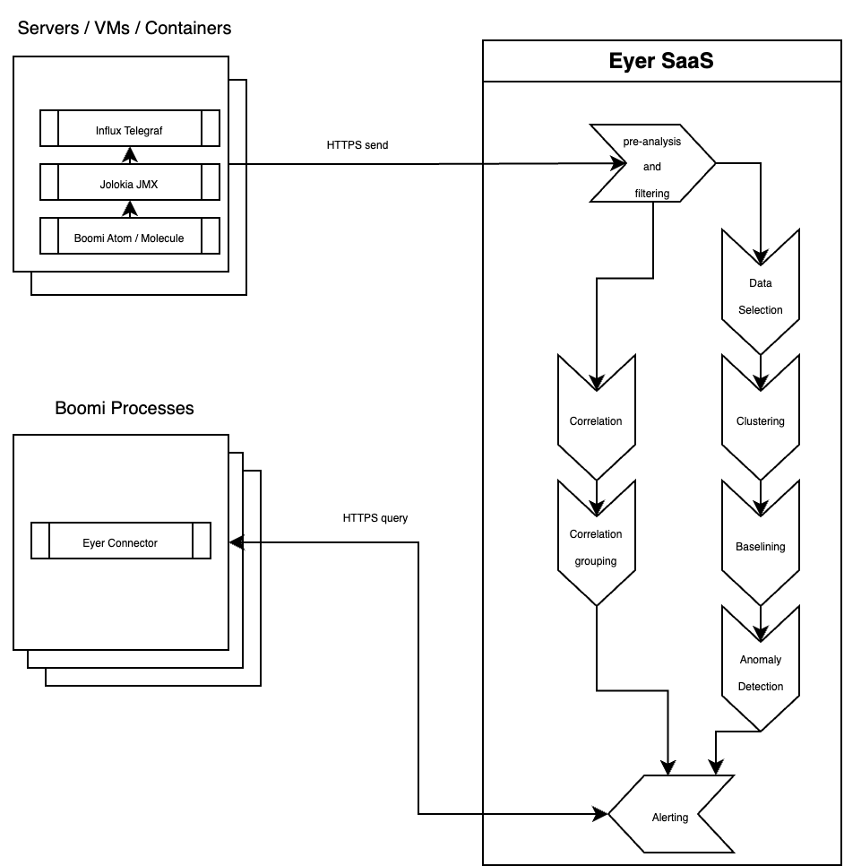

# Eyer Algorithm Overview

Our machine-learning pipeline comprises a series of algorithms that contribute to building an alert.

Machine Learning Pipeline Overview
The data are streamed live to the ML pipeline, preprocessed, and piped to two branches. One (in the image, the upper purple branch) takes care of the univariate anomaly detection, and another (the lower yellow one) computes correlations and groups together different time series according to their correlations. The univariate anomaly detection and the groups based on correlation are then combined into an alert that delivers jointly anomalies happening within the same correlation group.

The next sections will provide detailed descriptions of each part of the ML pipeline:
- Univariate anomaly detection
- Correlation and grouping of time series

## The Eyer Algorithm architecture

