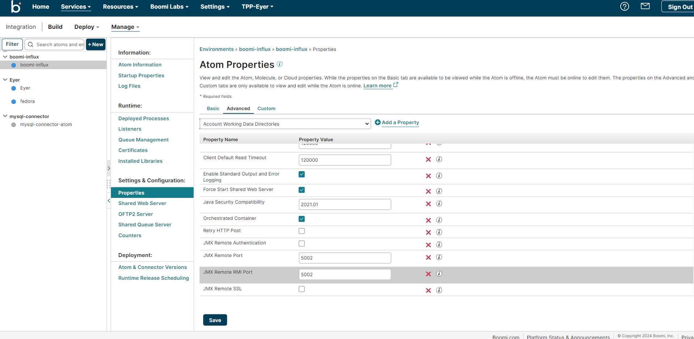

# Agentless - Install option 1 

The Eyer for Boomi connector setup requires you to download these three components:


* [Jetty (version 12 or higher)](https://eclipse.dev/jetty/download.php)
* [Influx Telegraf open source data collector](https://www.influxdata.com/downloads/)
* [Jolokia (war unsecured agent, version 2.02 or higher)](https://jolokia.org/download.html)


## Exposing JMX ports on your Atom

Log in to your [Boomi AtomSphere account](https://platform.boomi.com/) and select your Atom. Navigate to the **Properties -> Advanced** tab to add and expose the following JMX ports on your Atom:


* JMX Remote Port ( 5002 )
* JMX Remote RMI Port ( 5002 )
* JMX Remote SSL ( disabled )
* JMX Remote Authentication ( disabled )

Each of your Atoms should look like this when you are done.





Restart your Atom to see the changes.


## Deploying Jolokia in a Jetty server

After you've set up and configured your Boomi Atom, the next step is to create and deploy the Jetty server that will hold your Jolokia agent.

Deploy your Jetty server with the [Jetty official documentation](https://eclipse.dev/jetty/documentation/jetty-12/operations-guide/index.html). 

We recommend installing the demo applications with the `java -jar $JETTY_HOME/start.jar --add-module=demos` command to automatically set environment variables. The demo applications can be deleted later.

Before starting your Jetty server, rename the Jolokia WAR-Agent file you previously downloaded to `jolokia.war`. Then, copy this file into the `$JETTY_BASE/webapps` folder that was created during deployment.

Start your Jetty server with this command.

```

java -jar $JETTY_HOME/start.jar

```

Verify that Jetty is running by opening [http://localhost:8080/jolokia](http://localhost:8080/jolokia) in your browser.


## Installing Telegraf 

Telegraf is an open-source agent that collects metrics from your applications. Download and install the Telegraf agent that corresponds with your OS from the [InfluxData Downloads page](https://portal.influxdata.com/downloads/).

Next, rename the provided `eyer_agentless_telegraf.conf` file and to `telegraf.conf`. This file will replace the original `telegraf.conf` file in your Influx Telegraf folder. Afterward, make the following edits to the configuration file:


1. Enable authentication using your Eyer agent API token: In the `[outputs.http.headers]` section, locate the authenticate field and replace its value with your Eyer agent API token
2. Configure Jolokia connection: In the `# # Read JMX metrics from a Jolokia REST agent endpoint` section, make the following changes:

    * Locate the `[[inputs.jolokia2_proxy]]` section and replace the `x.x.x.x` path in the URL with your `jetty-jolokia` IP address.

      ```
      # # Read JMX metrics from a Jolokia REST agent endpoint
      [[inputs.jolokia2_proxy]]
        url = "http://x.x.x.x:8080/jolokia"
      ```


    * Locate the `[[inputs.jolokia2_proxy.target]]` section and replace the `x.x.x.x` path in the URL with your Boomi Atom’s IP address.  

      ```
      [[inputs.jolokia2_proxy.target]]
        url = "service:jmx:rmi:///jndi/rmi://x.x.x.x:5002/jmxrmi"
      ```


    If you only monitor a single atom, and if your Telegraf agent is hosted in the same location as the Jolokia agent,


    ```
     [[inputs.jolokia2_proxy.target]]
       # url = "service:jmx:rmi:///jndi/rmi://x.x.x.x:5002/jmxrmi"
       url = "service:jmx:rmi:///jndi/rmi://localhost:5002/jmxrmi"
    ```


3. Save the changes made to the `telegraf.conf` file.

4. When you are done with your edits, register and start the Telegraf agent, depending on your operating system.  

    * For Windows users, start your Telegraf agent with this command.

        ```

        telegraf.exe –config telegraf.conf

        ```


    * For Linux users, start your Telegraf agent with this command:

      ```


      sudo systemctl start telegraf


      ```
    * For MacOS users, start your Telegraf with this command.

      ```

      telegraf --config telegraf.conf

      ```


