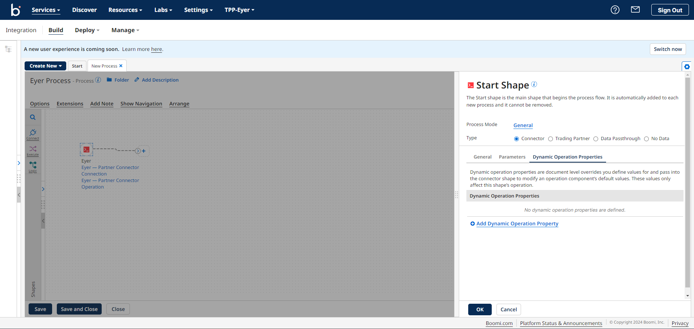

# Configuring the Eyer-Partner Connector

To start out with your Eyer monitoring process, go to the **Integration** page, click the **Create New** button, and choose **Process** from the dropdown menu.

This action will open the **Start Shape** sidebar. Choose the **Connector** radio button. 

Then, in the **Connector** input field, choose the **Eyer-Partner Connector**. 

**Creating an Eyer-Partner connection**

Next, click the **+** icon in the Connection input field to open up the Eyer connection page.

Leave the **Server** and the **Eyer authentication key fields** as their default values.

In the **Custom Authentication Credentials** field, click the **Encrypted** button and fill it out with your Eyer authentication key.

**Save and close** your connection to return to your sidebar.

**Creating Eyer-Partner operation**

In the Eyer connector sidebar, click the **+** icon in your Operation field to create a new Eyer operation. 

This action opens up an operation page.  Click the **Import Operation** button to create a new operation.

This action opens up the **Eyer-Partner Connector Operation Import** modal. Fill out this modal with the following information:

* **Atom**: The name of the Atom you are running the process in
* **Filter** (optional): Reduces the number of returned objects in your query by using filters with wildcard characters (* or ?) 

    

Click on the **Next** button to save your operation. Next, select the Object Type you’d like:

* An Object Type of **Anomalies** returns a list of anomaly alerts grouped by correlation
* An Object Type of **Anomalies with metrics** returns a list of anomaly alerts grouped by correlation metrics, including their respective values and baseline values at the time of the alert (new/updated)

Click on the **Next** button to save your **Object Type** preference, and click the **Finish** button to see your Eyer response profile loaded on your **Operation** page.

Operation values define the information required for anomaly alerts. The Eyer-Partner connector provides two methods for specifying these operation values, which are:

* **Using Options**: Options are ideal for defining static operation values for your Eyer-Partner connector. For example, if you wanted to query anomalies during a specific period, the Options fields are perfect for that use case.
* **Using the Dynamic Operation Property**: Dynamic Operation Properties are used to set dynamic operation properties. With data types and values like **Current Date,** **Relative Date**, **Last Run Date**, and **Last Successful Run Date**, you can configure your Eyer process to run perpetually, always listening for new or updated anomalies.

      

## Options

The Options section on your Operations page has the following fields: 

* **Tracking Direction**:  Choose between tracking Input Documents or Output Documents for the operation, determining which documents appear in Process Reporting. Regardless of your selection, Start Shapes always track output documents.
* **Error Behaviour**:  This field determines whether failed operations should be reported in Manage. If unchecked, failed operations will be reported. If you check this box, you indicate that you don't want failed operations reported in Manage, enabling you to handle them within your process.
* **Query from**: This field determines from what time the connector will query anomaly alerts. It is set in a timestamp format of YYYY-DD-MMTHH:MM:SSZ.
* **Query to**: This field defines the time until which the connector will query for anomaly alerts. This field is set in the timestamp format of YYYY-DD-MMTHH:MM:SSZ.
* **Query status**: This field has values of **new**, **updated**, and **closed** values. These values indicate you want to query anomalies that are:
    * **new**:  New anomaly alert since the last query
    * **updated**: Anomaly alert with updated values
    * **closed**: Anomaly alerts that have been fixed
* **Query severity:** This field has **low**, **medium**, and **severe** dropdown values. These values allow you to query anomalies with varying degrees of urgency, allowing you to prioritize and address issues accordingly. 

Click the **Save and Close** button to return to the Eyer connector sidebar.

## Setting Dynamic Operation Properties

The dynamic operation properties override your operation default values options.

One of the advantages of using Dynamic Operation Properties as opposed to Options is that you can dynamically configure your Query from and to timestamps variables.

We recommend that the Eyer-Partner Connector be in a process that is scheduled to run every 5 minutes, so with dynamically set properties, you can schedule the Eyer-Partner connector to check for **new**, **updated**, or **closed** anomalies every 5 minutes.

**Creating these Dynamic Operation properties**

To consistently check for new anomalies, navigate to the **Dynamic Operation Properties** tab and click the **Add Dynamic Operation Property** link to create new properties. 

This action opens up a **Parameter Value** modal; in this modal, select the following options:

* Input -> Query from
* Type -> Date/Time
* Date Mask -> yyyy-MM-dd’T’HH:mm:ssZ
* Date Type - > Last Successful Run Date

These Parameter Value options tell the Eyer-Partner Connector to start the query for anomalies since the last test.

Click the **OK** button to return to the Dynamic Operation Properties tab.

Next, create a new **Dynamic Operation Property** filling in the Parameter Value with the following information:

* Input -> Query to
* Type -> Date/Time
* Date Mask -> yyyy-MM-dd’T’HH:mm:ssZ
* Data Type -> Current Date

These values tell the Eyer-Partner Connector to query the current date for anomalies.

Click the **OK** button to save the parameter value and return to the sidebar. 

Click the **OK** button to save the **Dynamic Operation Property** configuration and return to the Boomi process canvas.

## Sending out the Alerts

The Eyer-Partner Connector sends out anomaly information in a JSON format. You can opt to receive this JSON object as [mail](https://help.boomi.com/docs/atomsphere/integration/connectors/r-atm-mail_connector_4e32e771-5351-4e2c-b1fd-d7bd1bd82f1a/#:~:text=Use%20the%20Mail%20connector%20to,exchanging%20data%20between%20trading%20partners.) or save it to your [local disk](https://www.google.com/search?q=disk+connector+boomi&sca_esv=f379c00181bfa713&sca_upv=1&sxsrf=ACQVn0-x4RDulioCFIK5D9HrNpaqAtoAGg%3A1713411770580&ei=upYgZvHxIvCzhbIPo-686Ak&oq=disk+&gs_lp=Egxnd3Mtd2l6LXNlcnAiBWRpc2sgKgIIADIKECMYgAQYJxiKBTIEECMYJzIEECMYJzILEAAYgAQYkQIYigUyCxAAGIAEGJECGIoFMgoQABiABBhDGIoFMgoQABiABBhDGIoFMgUQABiABDIFEAAYgAQyBRAAGIAESO0YUABYpAVwAHgBkAEAmAGPAqAB6AmqAQMyLTW4AQHIAQD4AQGYAgWgAv0JwgIXEC4YgAQYkQIYsQMY0QMYgwEYxwEYigXCAg4QABiABBixAxiDARiKBcICCxAAGIAEGLEDGIMBwgILEC4YgAQYsQMYgwHCAg0QABiABBixAxhDGIoFwgITEC4YgAQY0QMYQxjUAhjHARiKBcICEBAAGIAEGLEDGEMYgwEYigWYAwCSBwMyLTWgB944&sclient=gws-wiz-serp) using Boomi's extensive connector capabilities.

## Testing the Process

To verify if the process is working, click the** Arrange** button, then save and test the process. You should see your anomalies alert object in your mail or local disk.

//add an image

