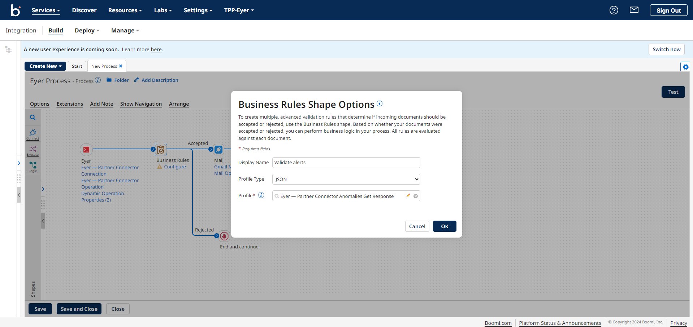
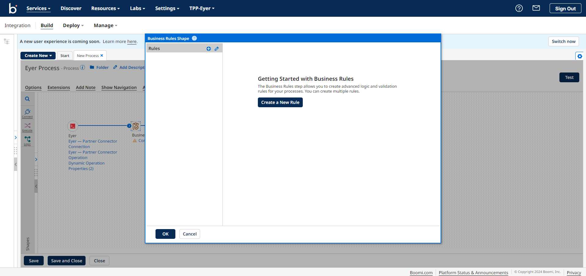
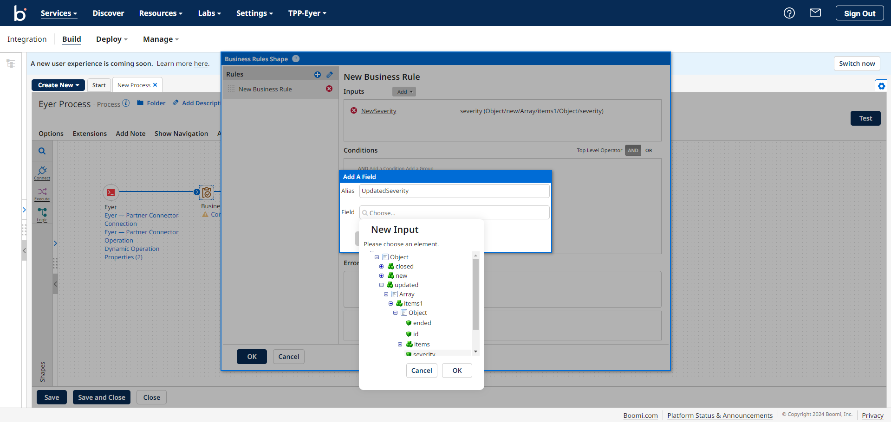
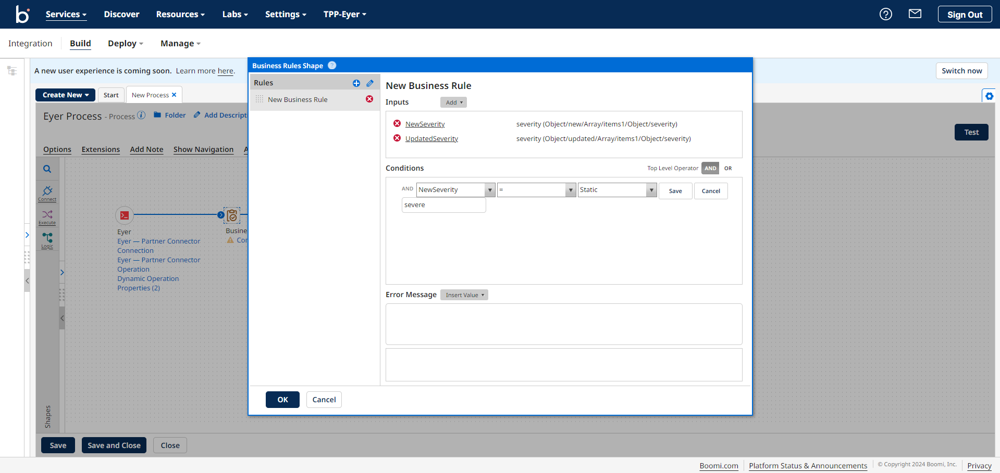
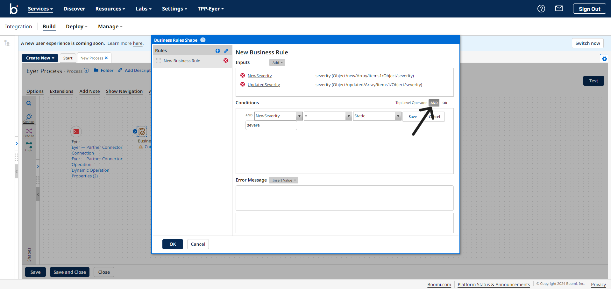
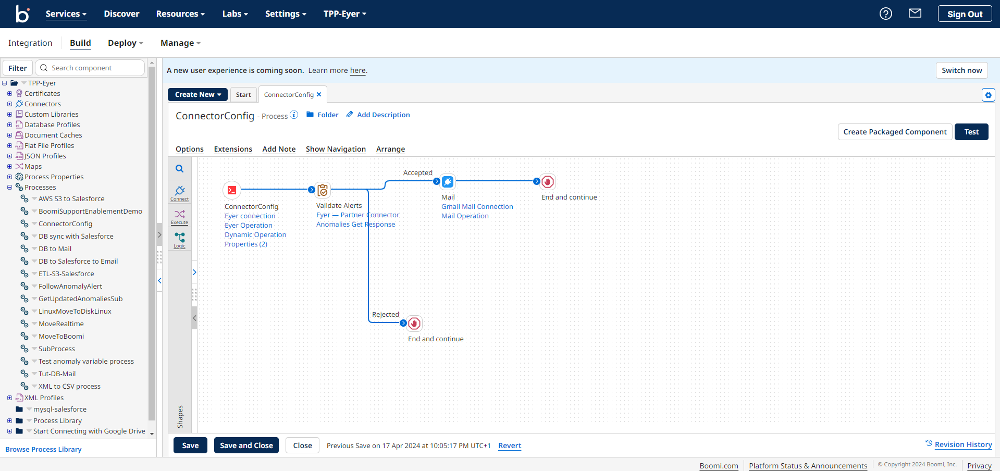

# Alert filtering: Get notified only for new, updated, or severe alerts. 

After configuring your Boomi connector, you can decide to be alerted or be emailed all the time when new alerts are created.

Another approach is to sift through the multiple alerts and ask to be alerted for any specific metric or severity. 

The Business Rules Shape helps us do this effectively. This section configures the Business rules shape to send out an alert when the anomalies are new, updated, and severe.

**Configuring the Business Rules Shape**

Add the Business Rules Shape to your Process.

Click on the **Business Rules** shape to open the **Business Rules Shape Options** modal. In this model, select a JSON profile type. In the Profile input field, you will see the profile you created for the Eyer-Partner connector. Simply select that profile.

Next, click the **OK** button to open the **Business Rules Shape** modal. In this modal, click the **Create a New Rule** button to create a new business rule.

To create a new input to feed into your Business Rules condition, click the **Add** dropdown, then select **Field** from the menu. This action will open an **Add a field** modal. Give the **Alias** field the name of **NewSeverity**.

Next, click on the **Field** input area to open a **New Input** modal within this modal. Select this menu **Object -> new -> Array -> items1 -> Object -> severity**.

Repeat the process above to create a new rule that checks if an alert is updated and severe. In the **Add a Field** modal, give the **Alias** field the name **UpdatedSeverity**.

In the Field input, select the menu **Object -> updated-> Array -> items1 -> Object -> severity**.

Next, check if these values are severe by creating a Business Rules Shape condition:

* Click the **Add a Condition** link:
* In the first dropdown, select the **NewSeverity** field
* In the second dropdown, select the **=** field
* In the third dropdown, select the **Static** field
* In the fourth field, input **severe**
* Click the **save** button

Next, select the **AND** top-level operator and repeat this process to create a condition for the **UpdatedSeverity** input.

Click the OK button to save the Business rules. 

Next, add your desired alerting medium, this documentation uses the Mail connector to send the alerts. To learn how to configure the Mail connector, check out the [Boomi documentation](https://help.boomi.com/docs/atomsphere/integration/connectors/r-atm-mail_connector_4e32e771-5351-4e2c-b1fd-d7bd1bd82f1a/#:~:text=Use%20the%20Mail%20connector%20to,exchanging%20data%20between%20trading%20partners.)

Next, add [Stop](https://help.boomi.com/docs/atomsphere/integration/process%20building/r-atm-stop_shape_d4dda1a9-8687-4418-8a3d-afe5f9174bc1/) shapes to the lines leading out from the Mail connector, and the Rejected path of the Business rules shape. 

Your process should look like this.

