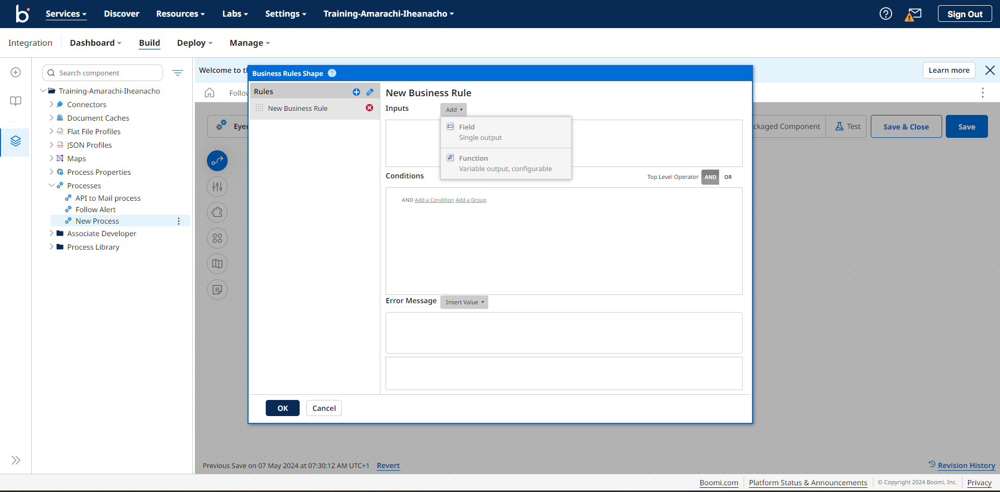

# Receive alerts on closed anomalies
This use case teaches you how to filter through the anomaly object and receive alerts for only  anomalies with a severity level of medium and above.

To set up alerts for closed anomalies, first, create a closed Boomi process using the Eyer-Partner connector.  For detailed instructions on setting up this connector, refer to the Configuring the [Eyer Connector documentation](https://eyer-docs.netlify.app/docs/getting-started-with-eyer/configuring-the-eyer-connector).

Your process should look like this:

Next, add a Business Rules Shape to filter through the anomalies for closed anomalies.

## Adding the Business rules shape to your process

The Business Rules Shape allows us to define rules in the Boomi connector. These rules help define certain criteria for your anomaly data.

To create these rules, you need the fields that capture the data from the object you want to check for. Additionally, you need to create conditions that define the criteria for these fields.

### Creating the Business Rules fields
Click on the Business Rules shape to open the **Business Rules Shape Options** modal. In this modal, select a JSON profile type. Select the profile you created in the Profile input field when configuring the Eyer-Partner connector.

Next, click the **OK** button to open the **Business Rules Shape** modal. In this modal, click the **Create a New Rule** button to create a closed business rule.

Next, click the **Add** dropdown. In this dropdown, select **Field** from the menu. 

This action will open an **Add a field** modal. In this modal, you'll find an "Alias" field where you can name your Business Rules shape field. For this use case, we'll use the alias "ClosedAnomalies".

Next, click on the **Field** input area to open a Closed Input modal within this modal. Select this menu: **Object -> closed -> Array -> items1 -> Object -> severity**.

Click the **OK -> OK** button to save your collection.

Next, click the **OR** button to signify that the test passes if either one of these conditions are true. 

Next, create a condition that checks the anomalies' severity.

### Creating the Business Rules condition
To create the condition that establishes the field criteria, follow these processes:

* Click the **Add a Condition** link:
* In the first dropdown, select the **ClosedAnomalies** field
* In the second dropdown, select the **=** field
* In the third dropdown, select the **Static** field
* In the fourth field, input “medium”
* Click the **Save** button

With this process, you've created a condition to check if the closed anomalies have medium severity. 

Repeat the create a condition process to check for closed anomalies with a severity level of "severe", but this time, replace the fourth field with the string "severe," as shown below:

Click the **OK** button to save the Business rules.

## Getting the Alerts

The [Boomi ecosystem offers many connectors](https://help.boomi.com/docs/atomsphere/integration/connectors/c-atm-connectors_bb305b35-0f13-4937-a918-f85dbbe1b27b/) that you can use to receive information on anomalies, with the most popular way of receiving these alerts being the Mail connector.  Check out the [Boomi documentation](https://help.boomi.com/docs/atomsphere/integration/connectors/r-atm-mail_connector_4e32e771-5351-4e2c-b1fd-d7bd1bd82f1a/#:~:text=Use%20the%20Mail%20connector%20to,exchanging%20data%20between%20trading%20partners.) to learn how to connect and configure your Mail connector.

The Boomi process checks if the rules defined in the Business Rules Shape are met. If the anomalies meet the criteria, an alert is sent. Otherwise, the process ends.