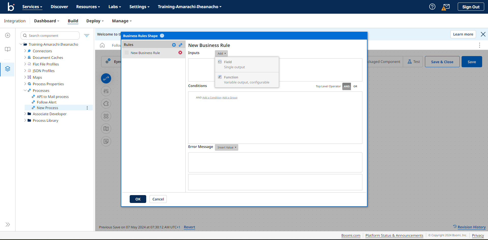
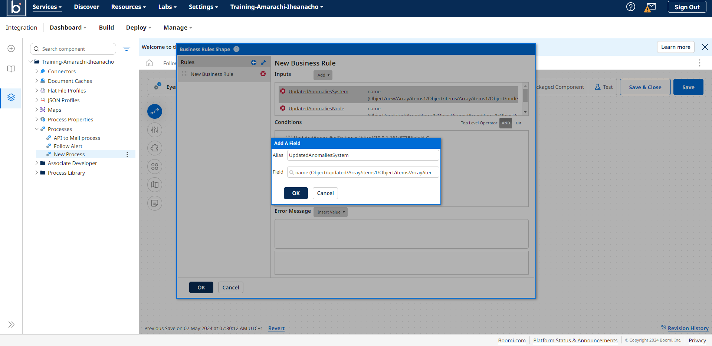
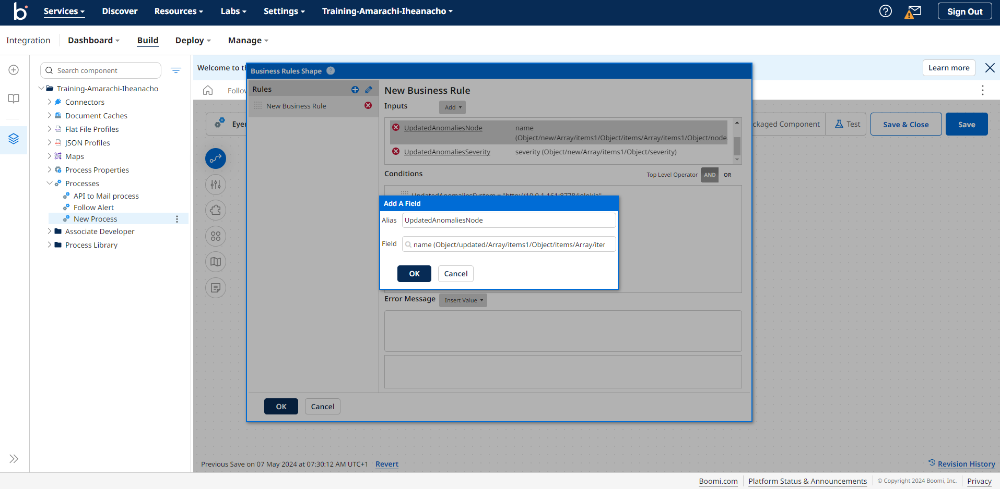
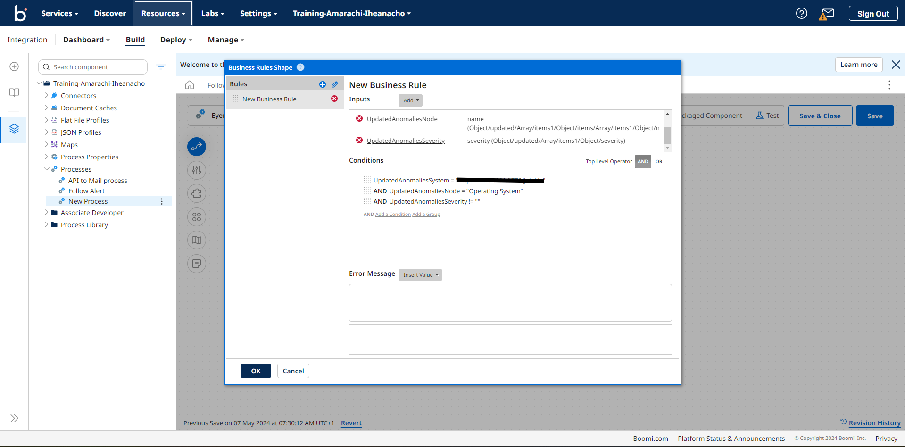
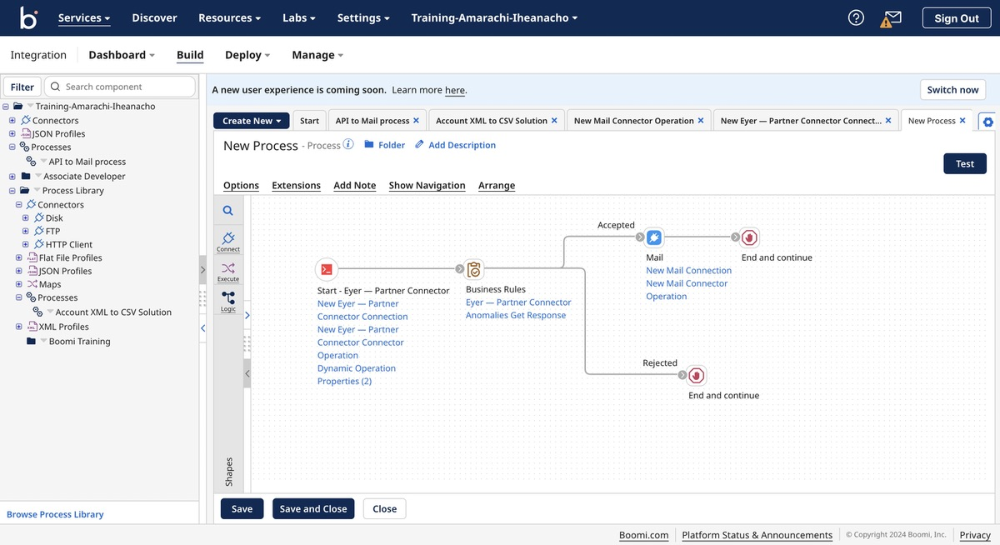

# Receive alerts on updated anomalies
This use case teaches you how to filter  anomalies and create an alert only when the updated anomalies contain anomalies on a specific system or node.

To set up alerts for updated anomalies, first, create a updated Boomi process using the Eyer-Partner connector.  For detailed instructions on setting up this connector, refer to the Configuring the [Eyer Connector documentation](https://eyer-docs.netlify.app/docs/getting-started-with-eyer/configuring-the-eyer-connector).

Your process should look like this:

**add an image**

Next, add a Business Rules Shape to filter through the anomalies for updated anomalies.

**add an image**

## Adding the Business rules shape to your process

The Business Rules Shape allows us to define rules in the Boomi connector. These rules help define certain criteria for your anomaly data.

To create these rules, you need the fields that capture the data from the object you want to check for. Additionally, you need to create conditions that define the criteria for these fields.

### Creating the Business Rules fields
Click on the Business Rules shape to open the **Business Rules Shape Options** modal. In this modal, select a JSON profile type. Select the profile you created in the Profile input field when configuring the Eyer-Partner connector.

**add an image**

Next, click the **OK** button to open the **Business Rules Shape** modal. In this modal, click the **Create a New Rule** button to create a updated business rule.

**add an image**

Next, click the **Add** dropdown. In this dropdown, select **Field** from the menu. 

This action will open an Add a field modal. In this modal, input an Alias of “UpdatedAnomaliesSystem”.

Next, click the Field input area to open the **New Input** modal menu. Navigate through the menu by selecting **Object -> updated-> Array -> items1 -> Object -> items ->  Array ->  items1 -> Object -> node -> Object -> system -> Object -> name**.

Click the** OK -> OK **button to save the field.

Next, create another field to capture the specific node where the anomaly occurred. Similar to creating the **UpdatedAnomaliesSystem** field, select the **Field** menu from the **Add **dropdown. 

This action opens up an **Add a field** modal; in this modal, input “UpdatedAnomaliesNode” in the **Alias** field.

Then, click the **Field** input area to open a **New Input** modal menu. within this modal. Navigate through the menu by selecting **Object -> updated-> Array -> items1 -> Object -> items ->  Array ->  items1 -> Object -> node -> Object -> name**.

Click the **OK -> OK** button to save the **UpdatedAnomaliesNode** field.

Next, create the last field to capture the severity of the anomalies. As you’ve done for the last two fields, select the **Field** menu from the **Add** dropdown. 

This action opens up an **Add a field** modal; in this modal, input “UpdatedAnomaliesSeverity” in the **Alias** field.

Then, click the **Field** input area to open the **New Input** modal menu. within this modal. Navigate through the menu by selecting **Object -> updated-> Array -> items1 -> Object -> severity**.

Click the **OK -> OK** button to save the options.

Once you've created the fields, you need to define the conditions that will trigger an alert. These conditions will check if the values in the fields match your criteria for receiving alerts.

Here are the three conditions you would define for this use case:

* The first condition verifies if the **UpdatedAnomaliesSystem** field matches the specific system you're interested in monitoring
* The second condition ensures the nodes involved in the anomaly alerts are the ones you care about. You'll use the **UpdatedAnomaliesNode** field to check this.
* The third condition confirms if the anomaly's severity level meets your threshold.

To create a new condition, perform the following processes:

* Click the **Add a Condition** link:
* In the first dropdown, select the **UpdatedAnomaliesSystem** field
* In the second dropdown, select the **=** field
* In the third dropdown, select the **Static** field
* In the fourth field, input the name of the System you care that the anomalies come from
* Click the **Save** button

Click the **AND** operator, then repeat the create a new condition process for the **UpdatedAnomaliesNodes** field. The differences to make are:

* In the first dropdown, input  UpdatedAnomaliesNodes
* In the fourth field, input the name of the node you are looking for

Click the **AND** operator, and repeat the create a condition process for the **UpdatedAnomaliesSeverity** field. The differences to make are: 

* In the first dropdown, input  **UpdatedAnomaliesSeverity**
* In the second dropdown, choose the **!=** operator
* Leave the fourth field empty.

This ensures that the severity field of the anomaly alerts is not empty.

Click the **OK** button to save the Business rules. Here is what your Business Rules shape should look like.

## Getting the Alerts

The [Boomi ecosystem offers many connectors](https://help.boomi.com/docs/atomsphere/integration/connectors/c-atm-connectors_bb305b35-0f13-4937-a918-f85dbbe1b27b/) that you can use to receive information on anomalies, with the most popular way of receiving these alerts being the Mail connector.  Check out the [Boomi documentation](https://help.boomi.com/docs/atomsphere/integration/connectors/r-atm-mail_connector_4e32e771-5351-4e2c-b1fd-d7bd1bd82f1a/#:~:text=Use%20the%20Mail%20connector%20to,exchanging%20data%20between%20trading%20partners.) to learn how to connect and configure your Mail connector.

The Boomi process checks if the rules defined in the Business Rules Shape are met. If the anomalies meet the criteria, an alert is sent. Otherwise, the process ends.